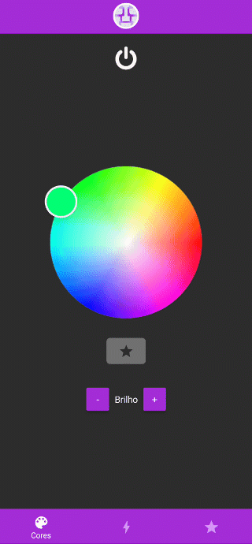

# app-controlador-fitaled

O Aplicativo controla uma fita de LED ligada em um Arduino, através da comunicação serial via Bluetooth ([Repositório com o código do Arduino](https://github.com/GustavoRFS/controlador-fitaled-arduino.git)).

 

